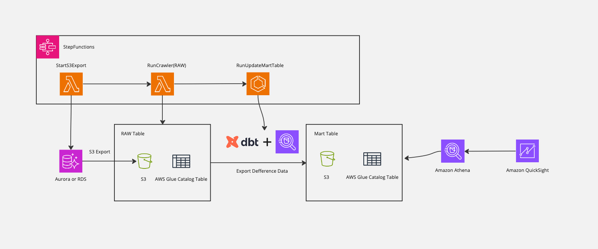

# Athenaを利用したパイプラインの構築
※ English follows Japanese.

このサンプルは、Amazon RDSのデータをAthenaでクエリするためのパイプラインを構築します。Amazon RDSからS3 Exportを利用して差分抽出を行い、Amazon Athenaでクエリを行うことができるようになります。Amazon Athenaで構築した基盤をベースにAmazon QuickSightで分析します。また、このサンプルではデータ変換処理に `dbt-athena`を利用しています。詳しくは[こちら](https://docs.getdbt.com/docs/core/connect-data-platform/athena-setup)。データのモデリングは、dbtの[Best practice guides](https://docs.getdbt.com/best-practices)にのっとり設計してください。

📣 **CAUTION** 📣
このサンプルは、公開時点のバージョンから破壊的変更が入っています。公開時のサンプルを参照したい場合は [v0.1.0](https://github.com/aws-samples/startup-data-pipeline-samples/tree/v0.1.0)をご利用ください。

## Architecture

1. S3 Export を利用して Aurora のデータを S3 にExportします。
   * S3 Exportの仕様上、Export対象は全データとなります
2. Amazon Athenaでクエリを行えるようにAWS GlueのCrawlerを利用して、TemporaryTable を作成します。
   * このTemporary Tableはデータのロードごとに削除されます
3. dbtを利用して、modelの定義に沿ってMartTableを更新します
   * サンプルでは、タイムスタンプ情報をよみとり差分データをInsertします
4. Athena および QuickSight で MartTable にクエリをかけます

1日に10人が10回ほどフルスキャンでクエリし、QuickSight上でデータを分析するケースを想定します。  
* 分析対象のデータ量は100GBあり、Parquetファイルに圧縮後は33GBとする
* 一日に一回更新を行う

おおよその月額費用：
* 初期費用：　**71 USD** (Athenaで分析者がクエリを行わない場合の費用)
* 従量課金込の費用：**563.244 USD**

|サービス名|費用|計算|
|---|---|---|
|S3 Export|36 USD| 100GB × 0.012(USD/GB)× 30 (days)|
|Glue Crawler|2.244 USD|0.44(USD/hour) / 6 (USD/10min) ×　30 (days)|
|Glue Catalog|Free|Glue Catalog: 10(人) × 10(クエリ/day) × 30(days) < 100万回未満のため無料|
|Athena|495 USD|0.033(TB) × 5(USD) × 10(人) × 10(クエリ/day) × 30(days)|
|QuickSight|30USD|3(USD) × 10(人)|

## Getting started
[こちら](./doc/ja.md)  をご参照ください。

   
   

# The pipeline from Amazon RDS through Amazon Athena

This sample describes how to build a pipeline for querying data from RDS on Athena. You can export data from RDS to S3, query the data on Athena, and visualize it on Amazon QuickSight.Additionally, this sample uses `dbt-athena` for data transformation processing. For more details, please refer to [here](https://docs.getdbt.com/docs/core/connect-data-platform/athena-setup). The data modeling should be designed based on dbt's [Best practice guides](https://docs.getdbt.com/best-practices).

📣 **CAUTION** 📣
This sample has breaking changes from the version at the time of release. If you want to refer to the sample at the time of release, please use [v0.1.0](https://github.com/aws-samples/startup-data-pipeline-samples/tree/v0.1.0).

## Architecture

1. Export the data from Amazon Aurora to S3 using S3 Export.
   * Determined by S3 Export specificationm, the all data is exported. 
2. Create a temporary table through the AWS Glue crawler for querying on Amazon Athena.
3. Transport data with dbt
   * In this sample, read the timestamp from the table records and export the difference data to S3.
4. Query the master table on Amazon Athena or Amazon QuickSight.

## Pricing example

The 10 persons query with a full scan 10 times per day, and analyze the data on Amazon QuickSight.

* The amount of data is 100GB, and in the zipped case, it is 33GB.
* Update data per day.

Appoximatery monthly cost: 

* Initial cost: **71 USD** (The case if you don't run queries with Athena)
* Containing pay-as-you-go: **563.244 USD**

|Service Name|Cost|Caluculate|
|---|---|---|
|S3 Export|36 USD| 100GB × 0.012(USD/GB)× 30 (days)|
|Glue Crawler|2.244 USD|0.44(USD/hour) / 6 (USD/10min) ×　30 (days)|
|Glue Catalog|Free|Glue Catalog: 10(person) × 10(Query/day) × 30(days) < Free Tier due to less than 1M access|
|Athena|495 USD|0.033(TB) × 5(USD) × 10(person) × 10(Query/day) × 30(days)|
|QuickSight|30USD|3(USD) × 10(person)|

## Getting started

Please refer [here](./doc/en.md)

## Licence 
This library is licensed under the MIT-0 License. See the [LICENSE](./LICENSE) file.

