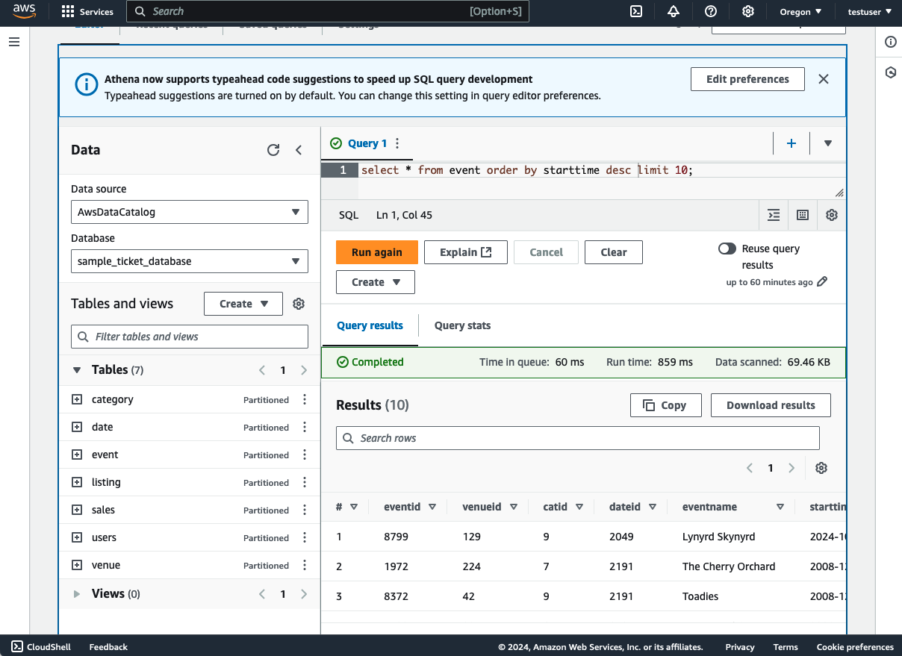

# Getting Started 

1. (If you use sample data) Create a bucket on S3, and upload the txt file from the unzipped `startup-data-pipeline-samples/sampledata/sample.tar.gz` file.  
※ DO NOT create the snapshot bucket because it is created automatically

2. Update the parameters in the `config/config.ts` file.

|Paramter|Details|Is Required|
|---|---|---|
|pipelineName|The name of pipeline|Yes|
|isExistDB|Use the DB created or not|Yes|
|dbClusterName|The name of database cluster|Yes|
|dbName|The name of database|Yes|
|schemaName|The name of schema|Yes|
|sampleDataBucketName|The bucket where the sample data for RDS is uploaded. |Yes|
|snapshotS3BucketName|The bucket where the snapshot data is saved. |Yes|
|s3ExportPrefix|The path where the data is exported. |Yes|
|enableBackupExportedData|The flag for saving RDS data created by S3 export. |Yes|
|loadSchedule|The interval of loading data from RDS. |Yes|


※ The default process of extracting differences from the previous data is to export data from the execution time to the defined range time.

Please also refer the example of the paramters to  `config/config.ts` file.

3. Run cdk command.
```
cdk deploy --all
```

4. (If you create the Aurora cluster with this sample.) Upload the sample data. 
   1. Access RDS from EC2. Open EC2 Service page on Management Console, select instance name starting with `SampleDataSourceStack`, and click "Connect".
   2.  In this sample, you can access by SessionManager. Select SessionManager tab and click "Connect". You will be able to access EC2 console.
   3.  The password of database is save in Secret Manager. Access the page of Secret Manager Service and click the secret desplayed as the name exported from the Outputs as `SampleDataSourceStack.RdsCredentialPath`.
   4.  Click `Retrieve secret value`, the password will be desplayed. Take this password.
   5.  In EC2 console, execute the following command.
   ```
   mysql -h <ZeroETLRDSStack.DBClusterHostname> -u admin -p
   ```
   6. Mofify the bucket name that is defined under of  `--- EDIT S3 BUCKET ---` on `sample/setupdata.sql`. The defalut value is `sample-ticket-data`.
   7. Execute the SQL in the `sample/setupdata.sql` file. The database, table, and data insertion will be started.


TIPS: This sample provide the option updating data manually.

1. Upload the all of data from Amazon RDS.
This sample has an option to upload all the data from RDS. When you deploy, you can use this to upload the data initially.

   1. Open the AWS Step Functions Service page in the AWS Management Console.
   

   2. Select state machine stating with `SampleAthenaPipeline`
   

   3. Enter the config JSON (the following example)as INPUT referring to `sample/sfninput.json` , Click "Start Execution".
   ```
   {
    "EnableBuckup": "True"
    }
   ```
    4. Review querting on Athena.
    


## Setup visualisations on Amazon QuickSight
If you have not created Amazon QuickSight account yet, please refer to bellow document.
https://docs.aws.amazon.com/ja_jp/quicksight/latest/user/signing-up.html

1. Login Amazon QuickSight as admin user.
2. Click "Manage QuickSight" > "Security & Permissions" > "QuickSight access to AWS services", and "Manage"

3. Select S3, and attach the authorization to target bucket.

4. Back to the top page, Click "Datasets" > "New Dataset" > "Athena" 

5. Select Workgroup, Glue database, table. 


6. You will be able to create dashboard after creating dataset.


## The case of changing the condition of extracting data
This pipeline utilizes dbt to define [table models](../dbt-container/dbt/models/). If you wish to modify the tables, please define the tables according to the dbt model creation method. Additionally, this sample uses `incremental` materialization for delta updates. If you need to update the delta logic, please update the `WHERE` clause under `is_incremental`. For more details, please refer to the dbt labs documentation [here](https://docs.getdbt.com/docs/build/materializations).

```
{{
    config (
        materialized = 'incremental',
        unique_key = 'starttime'
    )
}}
select
    *
from {{ source('raw','demodb_event') }}

    where starttime > cast((select max(starttime) from {{ this }}) as timestamp)

```

## The case of adding the data process
You can use dbt to integrate existing tables and create new tables, as well as perform other processing tasks. If you want to create a MartData, you can add a new dbt model to create a MartTable.

The example of `dbt-container/dbt/models/soldnum.sql`
```
with sales as (

    select * from {{source('raw','demodb_sales') }}

),

users as (

    select * from {{source('raw','demodb_users') }}

),

rawdate as (

    select * from {{source('raw','demodb_date') }}

),

sales_per_users as (
    select
        sellerid,
        username,
        city, 
        sum(qtysold) as qtysoldsum

    from sales, rawdate, users
    where sales.sellerid = users.userid
    and sales.dateid = rawdate.dateid
    group by sellerid, username, city
)


select * from sales_per_users
```

## Destroy environment
1. Delete the Glue tables
Open the AWS Glue Page and tables section. Delete the tables created by this pipeline.

2. Run the following command.


```
cdk destroy --all
```