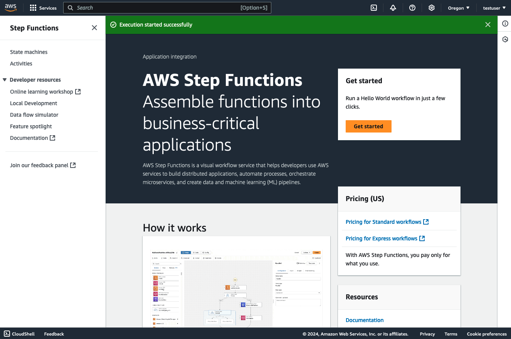
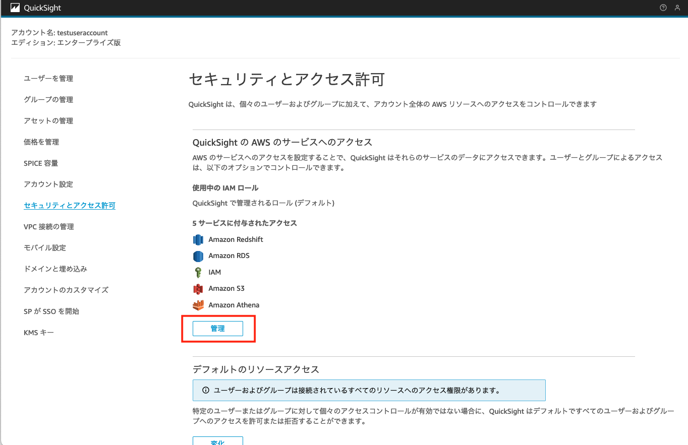

# 構築手順

1. (サンプルデータを利用する場合) S3に任意のバケットを作成し、`startup-data-pipeline-samples/sampledata/sample.tar.gz`　を解凍した .txt　ファイルをS3にアップロードします。
※ snapshot用のバケットは自動で作成されるので、作成しないでください。

2. `config/config.ts`のStackのProps上のパラメーターを更新する。

|Paramter|内容|必須|
|---|---|---|
|pipelineName|全体パイプラインの総称|必須|
|isExistDB|既存のDBの利用有無|必須|
|dbClusterName|RDSのクラスター名|必須|
|dbName|RDSのデータベース名|必須|
|schemaName|対象のRDSのスキーマ名|必須|
|sampleDataBucketName|RDS取り込む用のサンプルデータ|必須|
|snapshotS3BucketName|S3Exportおよび実データの出力バケット|必須|
|s3ExportPrefix|S3Exportのデータ出力先パス|必須|
|enableBackupExportedData|S3 Exportにて出力されたRDSのデータの保存の有効化フラグ|必須|
|loadSchedule|RDSからのデータのロード頻度|必須|


※ デフォルトの差分抽出のロジックは、レコードごとに定義されているタイムスタンプに対して、実行時間から指定期間に当てはまるタイムスタンプを抽出して出力します。（もし列名を指定しない場合はデータ更新がスキップされます）

パラメーター例は `config/config.ts`を参照してください。


3. cdkのコマンドを実行する

```
cdk deploy --all
```

4. (新規でデータベースを作成する場合)　サンプルデータを取り込みます。
   1. EC2からRDSへのアクセスを行います。Management Console上でEC2のサービスページを開き、`SampleDataSourceStack`から始まるインスタンス名を選択し、”Connect”をクリックします
   2. 本サンプルではSessionManagerからアクセスできるようになっています。SessionManagerタブを選択して、Connectします
   3. データベースのパスワードはSecretManagerに保存されています。Management Console上でSecretManagerのサービスページにアクセスし、デプロイ時の出力されたパラメーターのうち `SampleDataSourceStack.RdsCredentialPath` で出力されているSecret名をクリックします
   4. Secret Valueのにて、 `Retrieve secret value`　をクリックすると、パスワードが表示されます。こちらを控えます。
   5. デプロイ時に出力されたパラメーターを利用して、以下のコマンドを入力します 

    ```
    mysql -h <SampleDataSourceStack.DBClusterHostname> -u admin -p
    ```
    パスワード入力が求められるので、パスワードを入力します。

   6. `sample/setupdata.sql` の `--- EDIT S3 BUCKET ---` 以降で、手順1にて作成したS3バケットのバケット名を変更します。デフォルトは `sample-ticket-data`となっています。
   7. `sample/setupdata.sql` のSQL文を入力すると、データベース、テーブル、およびデータの挿入が実行されます


TIPS: このパイプラインはEventBridgeをトリガーに定期実行しますが、手動でも実行することができます。

   1. AWS Management Console上で、StepFunctionサービスを開く
   

   2. `SampleAthenaPipeline`から始まるステートマシーンを選択する
    

   3. 以下のJSONをInputとして入力し、"Start Execution"を押下する

   ```
   {
    "EnableBuckup": "True"
    }
   ```
   4. Athenaでクエリできれば完了です。
   


### Amazon QuickSightの設定

Amazon QuickSightのアカウント作成をされていない方はこちらをご参照ください。
https://docs.aws.amazon.com/ja_jp/quicksight/latest/user/signing-up.html

1. Amazon QuickSightに管理者としてログインする
2. 右上の「QuickSightを管理」＞「セキュリティとアクセスの許可」> 「QuickSight の AWS のサービスへのアクセス」から、「管理」をクリックする

3. S3を選択肢し、対象のS3Bucketのアクセス権限を付与する

4. トップに戻り、サイドバーのデータセットをクリックし、「データセットの作成」> 「Athena」をクリックします

5. 対象のワークグループ、作成されたGlueデータベース（PIPELINE名と同一です）、対象のテーブルを選択します


6. データセットが作成され、データの中身が作成できたり、分析上でダッシュボードを作成できるようになります。


## テーブルを変更したい場合
このパイプラインは、dbtを利用したテーブルの[モデル定義](../dbt-container/dbt/models/)を行っています。テーブルを変更したい場合は、dbtのmodelの作成方法に従ってテーブルを定義してください。また、このサンプルでは差分更新を `incremental` materializationを利用しています。差分のロジックを更新したい場合は、 `is_incremental` 配下の `WHERE` 文を更新してください。詳しくは、dbt labsのdocumentの[こちら](https://docs.getdbt.com/docs/build/materializations)をご参照ください。

```
{{
    config (
        materialized = 'incremental',
        unique_key = 'starttime'
    )
}}
select
    *
from {{ source('raw','demodb_event') }}

    where starttime > cast((select max(starttime) from {{ this }}) as timestamp)

```

## データの加工をしたい場合
dbtを利用して、既存のテーブルを統合して新たなテーブルを作成するなどの加工処理を行うことができます。このようなMartDataを作成したい場合は、dbtのmodelを新たに追加することでMartTableを作成することができます。

`dbt-container/dbt/soldnum.sql`の例

```
with sales as (

    select * from {{source('raw','demodb_sales') }}

),

users as (

    select * from {{source('raw','demodb_users') }}

),

rawdate as (

    select * from {{source('raw','demodb_date') }}

),

sales_per_users as (
    select
        sellerid,
        username,
        city, 
        sum(qtysold) as qtysoldsum

    from sales, rawdate, users
    where sales.sellerid = users.userid
    and sales.dateid = rawdate.dateid
    group by sellerid, username, city
)


select * from sales_per_users
```

## 環境の削除

1. AthenaのQuery出力用のバケット内の出力データを削除する。
Management Consoleから、S3のサービスページを開き、 `AthenaQueryResultBucket` から始まるバケットを選択して `Empty`をクリックします。

2. Glueのテーブルを削除します  
Management Consoleから、Glueのサービスページを開き、Tables セクションを開きます。削除対象のテーブルを選択し、Deleteする。

3. 以下のコマンドで環境を削除する

```
cdk destroy --all
```